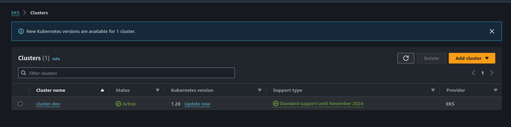

# Como criar um cluster kubernetes EKS na AWS com eksctl

<!--more-->

## Introdução

Após o último post sobre Kubernetes criando um cluster localmente, continuaremos a saga, mas agora criando um cluster Kubernetes na AWS, em um cenário um pouco mais próxima da realidade. Para criar um cluster kubernetes na AWS utilizaremos uma ferramenta chamada eksctl.

> eksctl é uma ferramenta CLI simples para criar e gerenciar clusters no EKS – serviço Kubernetes gerenciado da Amazon para EC2. Está escrito em Go, usa CloudFormation, foi criado pela Weaveworks e aceita contribuições da comunidade.

## Instalando o eksctl

### Linux
```shell
# for ARM systems, set ARCH to: `arm64`, `armv6` or `armv7`
ARCH=amd64
PLATFORM=$(uname -s)_$ARCH

curl -sLO "https://github.com/eksctl-io/eksctl/releases/latest/download/eksctl_$PLATFORM.tar.gz"

# (Optional) Verify checksum
curl -sL "https://github.com/eksctl-io/eksctl/releases/latest/download/eksctl_checksums.txt" | grep $PLATFORM | sha256sum --check

tar -xzf eksctl_$PLATFORM.tar.gz -C /tmp && rm eksctl_$PLATFORM.tar.gz

sudo mv /tmp/eksctl /usr/local/bin
```

### Windows e Mac
```powershell
choco install eksctl
```
https://eksctl.io/installation/#for-windows

```shell
brew tap weaveworks/tap
brew install weaveworks/tap/eksctl
```
https://eksctl.io/installation/#for-macos

Vamos testar se está tudo funcionando:

```shell
➜ eksctl info
eksctl version: 0.167.0
kubectl version: v1.28.2
OS: linux
```

Com a ferramenta eksctl precisamos também que as [credenciais da AWS](https://docs.aws.amazon.com/pt_br/cli/latest/userguide/cli-configure-envvars.html) já estejam configuradas, a partir dai podemos começar a utilizar a ferramenta. Temos duas formas que criar um cluster EKS, utilizando somente a *linha de comando*, passando todos os parâmetros necessários ou com um *arquivo YAML de configuração* para definirmos como queremos criar o nosso cluster.

## Criando cluster via linha de comando

Primeiro podemos testar se já temos algum cluster criado:
```shell
➜ eksctl get cluster                
No clusters found
```

Como podemos ver ainda não temos nenhum cluster criado. Vamos então criar um cluster simples utilizando a linha de comando:

```shell
➜ eksctl create cluster
[ℹ]  using region us-west-2
[ℹ]  setting availability zones to [us-west-2a us-west-2c us-west-2b]
[ℹ]  subnets for us-west-2a - public:192.168.0.0/19 private:192.168.96.0/19
[ℹ]  subnets for us-west-2c - public:192.168.32.0/19 private:192.168.128.0/19
[ℹ]  subnets for us-west-2b - public:192.168.64.0/19 private:192.168.160.0/19
[ℹ]  nodegroup "ng-98b3b83a" will use "ami-05ecac759c81e0b0c" [AmazonLinux2/1.11]
[ℹ]  creating EKS cluster "floral-unicorn-1540567338" in "us-west-2" region
[ℹ]  will create 2 separate CloudFormation stacks for cluster itself and the initial nodegroup
[ℹ]  if you encounter any issues, check CloudFormation console or try 'eksctl utils describe-stacks --region=us-west-2 --cluster=floral-unicorn-1540567338'
[ℹ]  2 sequential tasks: { create cluster control plane "floral-unicorn-1540567338", create nodegroup "ng-98b3b83a" }
[ℹ]  building cluster stack "eksctl-floral-unicorn-1540567338-cluster"
[ℹ]  deploying stack "eksctl-floral-unicorn-1540567338-cluster"
[ℹ]  building nodegroup stack "eksctl-floral-unicorn-1540567338-nodegroup-ng-98b3b83a"
[ℹ]  --nodes-min=2 was set automatically for nodegroup ng-98b3b83a
[ℹ]  --nodes-max=2 was set automatically for nodegroup ng-98b3b83a
[ℹ]  deploying stack "eksctl-floral-unicorn-1540567338-nodegroup-ng-98b3b83a"
[✔]  all EKS cluster resource for "floral-unicorn-1540567338" had been created
[✔]  saved kubeconfig as "~/.kube/config"
[ℹ]  adding role "arn:aws:iam::376248598259:role/eksctl-ridiculous-sculpture-15547-NodeInstanceRole-1F3IHNVD03Z74" to auth ConfigMap
[ℹ]  nodegroup "ng-98b3b83a" has 1 node(s)
[ℹ]  node "ip-192-168-64-220.us-west-2.compute.internal" is not ready
[ℹ]  waiting for at least 2 node(s) to become ready in "ng-98b3b83a"
[ℹ]  nodegroup "ng-98b3b83a" has 2 node(s)
[ℹ]  node "ip-192-168-64-220.us-west-2.compute.internal" is ready
[ℹ]  node "ip-192-168-8-135.us-west-2.compute.internal" is ready
[ℹ]  kubectl command should work with "~/.kube/config", try 'kubectl get nodes'
[✔]  EKS cluster "floral-unicorn-1540567338" in "us-west-2" region is ready
```

Como não passamos nenhum parâmetro o cluster será criado com os valores padrões:
- Nome gerado automaticamente
- Dois worker nodes de tamanho `m5.large`
- Usa o AWS [EKS AMI](https://github.com/awslabs/amazon-eks-ami) oficial
- Região`us-west-2`
- Uma VPC dedicada

Podemos também personalizar nosso cluster personalizando os parâmetros passados, como, por exemplo, personalizar nome, quantidade de nós do cluster e especificar a versão do kubernetes utilizada.

```shell
eksctl create cluster --name=cluster-dev --nodes=4 --version=1.28
```

Para saber quais parâmetros que podemos utilizar, podemos usar o comando abaixo:
```shell
➜ eksctl create cluster --help
```

## Criando cluster via arquivo de configuração

Outra forma de criar um cluster é utilizando um arquivo de configuração. Eu acredito ser a maneira ideal, pois podemos compartilhar o arquivo ou manter-lô em um repositório como o github, por exemplo. No nosso exemplo estamos criando um cluster na região us-east-1 com dois node groups de tamanhos e capacidades diferentes. Daremos o nome para o arquivo de cluster.yaml:

```yaml
apiVersion: eksctl.io/v1alpha5
kind: ClusterConfig

metadata:
  name: basic-cluster
  region: us-east-1

nodeGroups:
  - name: ng-1
    instanceType: m5.large
    desiredCapacity: 10
  - name: ng-2
    instanceType: m5.xlarge
    desiredCapacity: 2
```

Para criar o cluster só precisamos apontar o arquivo de configuração que criamos na etapa anterior:

```shell
eksctl create cluster -f cluster.yaml
```

## Gerenciando o cluster

Após o cluster ser criado já podemos gerenciar o mesmo usando kubectl ou qualquer ferramenta que prefira. Primeiro vamos conferir o cluster criado:

```shell
➜ eksctl get cluster                                               
NAME		REGION		EKSCTL CREATED
cluster-dev	us-east-1	True
```

No console da AWS:


Realizando algumas validações com alguns comandos no kubectl:
```shell
➜ kubectl get nodes
NAME                             STATUS   ROLES    AGE    VERSION
ip-192-168-42-117.ec2.internal   Ready    <none>   106s   v1.28.5-eks-5e0fdde
➜ kubectl get pods -A
NAMESPACE     NAME                       READY   STATUS    RESTARTS   AGE
kube-system   aws-node-626mv             2/2     Running   0          2m13s
kube-system   coredns-86969bccb4-sxgkp   1/1     Running   0          8m6s
kube-system   coredns-86969bccb4-xc5gh   1/1     Running   0          8m6s
kube-system   kube-proxy-lttsv           1/1     Running   0          2m13s
```

## Deletando cluster

Caso seu cluster seja somente para testes e não queira gastar deixando ele ligado por muito tempo, podemos deletar o cluster com o comando abaixo:

```shell
➜ eksctl delete cluster cluster-dev                    
2024-02-07 08:54:36 [ℹ]  deleting EKS cluster "cluster-dev"
2024-02-07 08:54:38 [ℹ]  will drain 0 unmanaged nodegroup(s) in cluster "cluster-dev"
2024-02-07 08:54:38 [ℹ]  starting parallel draining, max in-flight of 1
2024-02-07 08:54:39 [ℹ]  deleted 0 Fargate profile(s)
2024-02-07 08:54:40 [✔]  kubeconfig has been updated
2024-02-07 08:54:40 [ℹ]  cleaning up AWS load balancers created by Kubernetes objects of Kind Service or Ingress
2024-02-07 08:54:43 [ℹ]  
2 sequential tasks: { delete nodegroup "ng-3bc9974c", delete cluster control plane "cluster-dev" [async] 
}
2024-02-07 08:54:43 [ℹ]  will delete stack "eksctl-cluster-dev-nodegroup-ng-3bc9974c"
2024-02-07 08:54:43 [ℹ]  waiting for stack "eksctl-cluster-dev-nodegroup-ng-3bc9974c" to get deleted
2024-02-07 08:54:44 [ℹ]  waiting for CloudFormation stack "eksctl-cluster-dev-nodegroup-ng-3bc9974c"
2024-02-07 08:55:14 [ℹ]  waiting for CloudFormation stack "eksctl-cluster-dev-nodegroup-ng-3bc9974c"
2024-02-07 08:55:56 [ℹ]  waiting for CloudFormation stack "eksctl-cluster-dev-nodegroup-ng-3bc9974c"
2024-02-07 08:57:36 [ℹ]  waiting for CloudFormation stack "eksctl-cluster-dev-nodegroup-ng-3bc9974c"
2024-02-07 08:59:09 [ℹ]  waiting for CloudFormation stack "eksctl-cluster-dev-nodegroup-ng-3bc9974c"
2024-02-07 08:59:48 [ℹ]  waiting for CloudFormation stack "eksctl-cluster-dev-nodegroup-ng-3bc9974c"
2024-02-07 09:01:29 [ℹ]  waiting for CloudFormation stack "eksctl-cluster-dev-nodegroup-ng-3bc9974c"
2024-02-07 09:02:01 [ℹ]  waiting for CloudFormation stack "eksctl-cluster-dev-nodegroup-ng-3bc9974c"
2024-02-07 09:03:24 [ℹ]  waiting for CloudFormation stack "eksctl-cluster-dev-nodegroup-ng-3bc9974c"
2024-02-07 09:04:44 [ℹ]  waiting for CloudFormation stack "eksctl-cluster-dev-nodegroup-ng-3bc9974c"
2024-02-07 09:04:44 [ℹ]  will delete stack "eksctl-cluster-dev-cluster"
2024-02-07 09:04:45 [✔]  all cluster resources were deleted
```

Para mais configurações podemos acessar a documentação oficial https://eksctl.io/getting-started/

---

> Autor: Sidnei Weber  
> URL: https://sidneiweber.com.br/como-criar-cluster-kubernetes-eks-na-aws-com-eksctl/  

