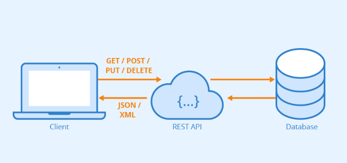
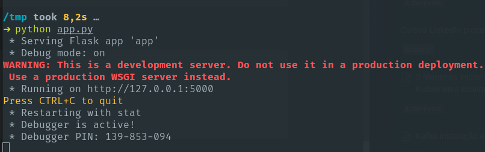

# Criando uma API REST em Python com Flask

<!--more-->

## O que é uma API REST

Uma API REST (Representational State Transfer ou Transferência de Estado Representacional) é um tipo de arquitetura para a construção serviços. Essa abordagem permite a comunicação entre os sistemas usando os protocolos padrão da web, como HTTP.



Principais características de uma API REST:

* **Arquitetura cliente-servidor**: A comunicação ocorre entre um cliente (como um navegador web ou um aplicativo móvel) e um servidor, seguindo o modelo de requisição e resposta.

* **Estado Representacional**: Os recursos (dados ou funcionalidades) são representados por meio de URLs acessíveis através do HTTP, e o estado do recurso é transferido entre o cliente e o servidor nas requisições e respostas.

* **Operações HTTP**: As operações HTTP (GET, POST, PUT, DELETE, etc.) são utilizadas para manipular os recursos. Por exemplo, GET é usado para recuperar recursos, POST para criar novos recursos, PUT para atualizar recursos existentes e DELETE para remover recursos.

* **Sem estado (Stateless)**: Cada requisição do cliente para o servidor deve conter todas as informações necessárias para o servidor entender e processar a requisição, sem depender de nenhum estado mantido no servidor entre as requisições.

* **Interoperabilidade**: As APIs REST são independentes de linguagem de programação e plataforma, o que significa que podem ser desenvolvidas e consumidas por uma variedade de tecnologias.

* **Formatos de Representação de Dados**: As APIs REST geralmente suportam vários formatos de dados, como JSON (JavaScript Object Notation) e XML (eXtensible Markup Language), para representar os recursos transferidos entre o cliente e o servidor.

## Exemplo prático

### VirtualEnv

Para facilitar precisamos ter instalado o virtualenv para Python.

Isso faz com que as dependências sejam sempre instaladas em uma virtualenv específica, não mais no sistema operacional. A partir daí, cada projeto executa seu código-fonte utilizando sua virtualenv própria.

No Debian/Ubuntu podemos instalar com o seguinte comando:

```shell
apt install virtualenv
```

Ou podemos utilizar o próprio pip do Python

```shell
pip install virtualenv
```

Vamos criar um virtualenv chamado venv. Existem duas formas de fazermos isso, utilizando o próprio virtualenv ou com o python diretamente:

```shell
virtualenv venv
# Ou utilizando o python com opção -m
python3 -m venv .
```

Para ativar o virtualenv criado utilizamos o comando source:

```shell
source venv/bin/activate
```

Com isso já temos tudo pronto para começar a instalar nossas bibliotecas e criar nosso código.

### Instalando Flask e começando a codar

Instalando Flask:

```shell
pip install flask
```

Para o nosso código vamos criar o arquivo `app.py`. Começaremos importando as bibliotecas que vamos utilizar em nosso código:

```python
# Importando bibliotecas
from flask import Flask, jsonify, request 
```

Após isso precisamos criar nossa aplicação utilizando o Flask:

```python
# Criar flask app
app = Flask(__name__) 
```

Agora precisamos criar nossa rota que será acessada e a lógica que ela vai executar quando for chamada:

```python
# Criação da rota
@app.route('/') 
def home():   
     data = "hello world"
     return jsonify({'data': data}) 
```

Aqui a lógica é simples, quando a rota for acessada uma variável chamada `data` receberá uma string e será retornada em um JSON. Agora só nos resta inicializar tudo que foi codificado anteriormente.

```python
# Inicializando
if __name__ == '__main__': 
    app.run(debug = True)
```

E o arquivo completo fica assim:

```python
# Importando bibliotecas
from flask import Flask, jsonify, request 
  
# Criar flask app
app = Flask(__name__) 
  
# Criação de rotas 
@app.route('/') 
def home():   
     data = "hello world"
     return jsonify({'data': data}) 
  
# Inicializando
if __name__ == '__main__': 
    app.run(debug = True)
```

### Rodando nossa aplicação

Para rodar nossa aplicação rodaremos o seguinte comando:

```shell
python app.py
```
Se a saída no terminal for parecida com a imagem abaixo é por que deu tudo certo:



E para testar é muito simples, podemos executar um curl no endereço localhost e na porta 5000 (porta padrão do flask).

```shell
➜ curl 127.0.0.1:5000      
{
  "data": "hello world"
}
```

Bom, se não ocorreu nenhum erro já está funcionando, mas para não ficarmos em um exemplo tão simples e trivial, vamos adicionar alguma lógica nesse serviço. Vamos criar um serviço que gere números aleatórios em um range solicitado, como se fosse uma API sorteadora de números.

Vamos adicionar algumas novas bibliotecas que iremos utilizar e ajustar a nossa rota principal com o código abaixo:

```python
# Importando bibliotecas
from flask import Flask, jsonify, request
from random import randint
from datetime import datetime

# Criar flask app
app = Flask(__name__)

@app.route('/')
def home():
    pessoas = request.args.get('pessoas', default=10, type=int)
    sorteados = request.args.get('sorteados', default=1, type=int)
    data = datetime.now()
    numbers = set()
    while len(numbers) < sorteados:  # enough is defined somewhere...
        numbers.add(randint(0, pessoas))
    s = list(numbers)

    return jsonify({'numeros_sorteados': s, 'data': data.strftime('%d/%m/%Y %H:%M')})

if __name__ == '__main__':
    app.run(debug=True)
```

Vamos testar novamente, por padrão será sorteado somente um número de 1 a 10, podemos passar também valores específicos como verá nos exemplos abaixo:

```shell
➜ curl 127.0.0.1:5000
{
  "data": "07/03/2024 15:27",
  "numeros_sorteados": [
    10
  ]
}
➜ curl '127.0.0.1:5000/?pessoas=100&sorteados=3'
{
  "data": "07/03/2024 15:29",
  "numeros_sorteados": [
    33,
    6,
    71
  ]
}
➜ curl '127.0.0.1:5000/?pessoas=100&sorteados=1'
{
  "data": "07/03/2024 15:29",
  "numeros_sorteados": [
    30
  ]
}

```

Se o retorno foi um JSON com os números sorteados está feito, temos nossa primeira API REST escrita, simples ainda, mas que logo usaremos para ir avançando para exemplificar alguns conceitos que podem nos ajudar no dia a dia do mundo Devops, Cloud e Observabilidade.

https://www.hostinger.com.br/tutoriais/api-restful

https://flask.palletsprojects.com/en/2.2.x/tutorial/

---

> Autor: Sidnei Weber  
> URL: https://sidneiweber.com.br/criando-api-rest-em-python-com-flask/  

